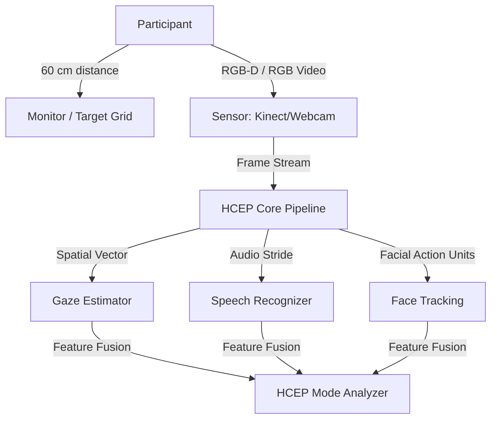

# HCEP Empirical Validation Protocol
## Human Communication Eye Protocol (HCEP) Validation Framework

This protocol defines the standardized experimental design and empirical validation methodology for verifying the accuracy, reliability, and emotional-cognitive classification performance of the Human Communication Eye Protocol (HCEP).

---

## 1. Objectives & Scope
The goal of this protocol is to empirically validate:
1. **Spatial Gaze Precision:** Accuracy of the three-stage gaze estimation pipeline (visual target offset in degrees).
2. **HCEP Mode Classification:** Correctness of the five-mode state machine (`Logic`, `Affect`, `Spirit`, `Heart`, `Think`) against ground-truth human behaviors.
3. **Temporal Stability:** Performance of the temporal hysteresis filter in mitigating sensor noise without introducing excessive latency.

---

## 2. Participant Cohort
- **Target Size:** $N = 60$ participants to ensure statistical power for Gaze Deviation and Mode Classification analyses.
- **Inclusion Criteria:** 
  - Age $\ge 18$ years.
  - Normal or corrected-to-normal vision (contacts/glasses permitted).
  - Ability to provide written informed consent.
- **Exclusion Criteria:**
  - Severe oculomotor disorders (e.g., strabismus, nystagmus) that disrupt pupil/iris tracking geometry.
  - Inability to sit before a computer monitor for 30 minutes.

---

## 3. Experimental Setup & Apparatus
- **Hardware Matrix:**
  - Kinect for Windows V1/V2 (for legacy depth/spatial validation).
  - Standard USB HD Webcam (1080p, 30fps) for webcam-only fallback validation.
  - 24-inch Monitor ($1920 \times 1080$ resolution).
- **Environment:**
  - Controlled ambient illumination (300–500 lux).
  - Screen distance fixed at $60\text{ cm} \pm 5\text{ cm}$.
  - Camera mounted directly above/below the screen center.

---

## 4. Methodology & Calibration
Before each trial, participants complete a standard 9-point visual calibration:
1. Targets appear sequentially at coordinate grids: Center, Corners, and Edge midpoints.
2. The user dwells on each target for 1.5 seconds.
3. Root-Mean-Square (RMS) angular offset is calculated. Calibration passes if the mean error is $< 1.5^\circ$ of visual angle.

---

## 5. Mode Induction Tasks (Ground Truth Elicitation)
Participants undergo five structured blocks, each designed to induce a specific HCEP mode:

| Induced Mode | Validation Task Description | Expected Biometric Indicators |
| :--- | :--- | :--- |
| **Logic** | Analytical puzzle-solving, spatial reasoning, and symbol-matching tasks under time limits. | Sustained center gaze, focused facial expressions, reduced blink rate, low valence. |
| **Affect** | Viewing short standardized video clips from the International Affective Picture System (IAPS) / film database. | Micro-expression spikes (smile/brow lower), higher/lower valence, dynamic gaze shifts. |
| **Spirit** | Simulated personal dialogue or mutual eye contact exercise with a virtual human/avatar. | Sustained eye-to-eye gaze vector, mutual alignment, neutral-to-positive valence, conversational blinks. |
| **Heart** | Empathetic listening task: viewing a personal narrative of a human sharing a difficult life event. | Softened facial features, periodic nodding (gaze pitch shifts), low brow contraction, positive/empathic valence. |
| **Think** | Internal cognitive load task: mental arithmetic (e.g., serial 7 subtraction) or memory recall. | Gaze aversion (looking away from screen/face targets), increased blink rate, high cognitive load score. |

---

## 6. Ground-Truth Data & Annotation
- **Biometric Logs:** Continuous recording of eye gaze coordinates, action unit intensities, valence, and speech transcripts.
- **Manual Coding:** Three independent human evaluators annotate the participant's video/audio logs frame-by-frame, classifying the participant's mode based on video recordings.
- **Inter-Rater Reliability:** Measured using Cohen's Kappa ($\kappa$). Annotations with $\kappa < 0.75$ are resolved via panel consensus.

---

## 7. Metrics & Statistical Validation
- **Gaze Estimation Error:** 
  $$\text{Mean Angular Error} = \frac{1}{N} \sum_{i=1}^{N} \arccos\left(\mathbf{v}_{gaze, i} \cdot \mathbf{v}_{target, i}\right)$$
- **Classification Accuracy:** Confusion Matrix, Precision, Recall, and F1-Score for each of the 5 HCEP modes.
- **Hysteresis Performance:** Assessment of transition latency (frames required to register a mode change) vs. state stability (flicker rate under raw sensor jitter).
