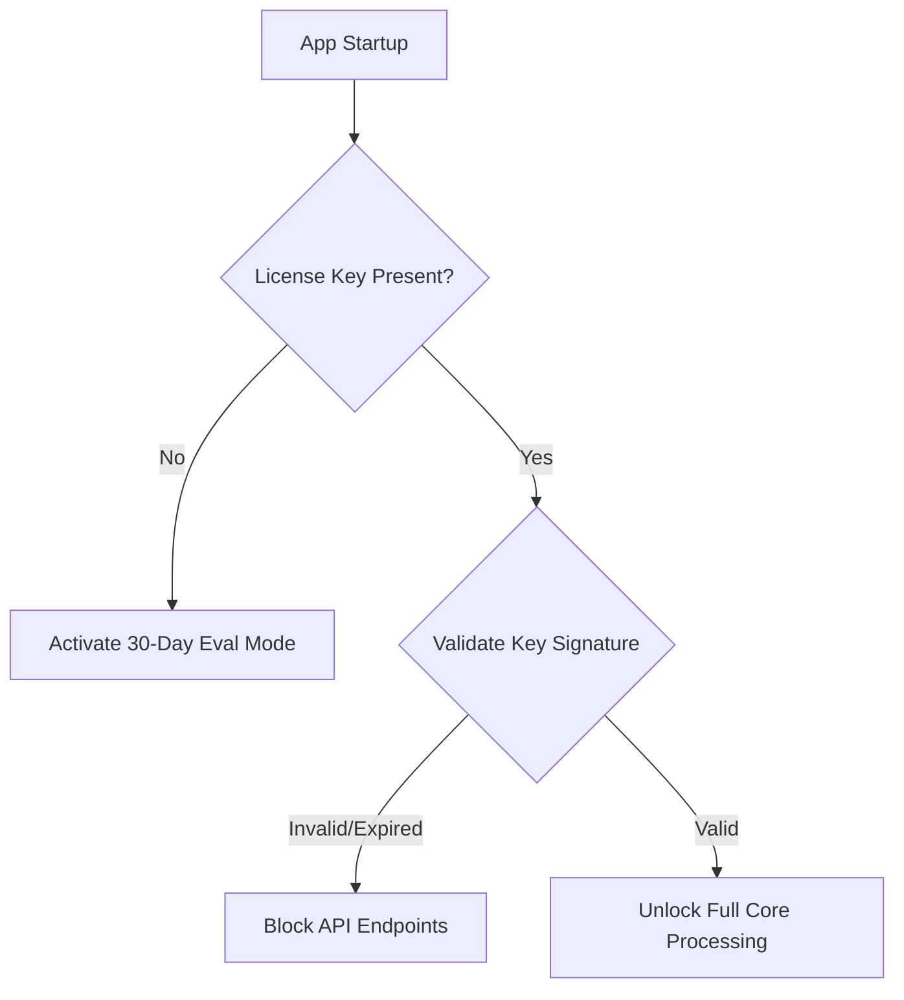

# HCEP — Intellectual Property Protection & Commercialization Guide

This document outlines the strategic legal, technical, and architectural methods to protect your IP, enforce your license, and publish the Human Communication Eye Protocol (HCEP) for both testing and commercial licensing.

---

## 1. Legal Protection Strategy

### A. Trade Secret Protection Protocol (Recommended)

Instead of filing patents—which requires publicly disclosing the exact mathematical algorithms, making them easy for competitors to copy or slightly modify—rely on **Trade Secrets** and proprietary commercial licensing.

* **No Public Disclosure:** Your core algebraic algorithms (True Gaze™ offset geometry and cognitive-emotional classification weights) remain completely hidden inside compiled binaries.
* **Infinite Duration:** Unlike patents (which expire in 20 years), trade secrets protect your IP indefinitely as long as reasonable efforts are made to keep them secret.
* **Lower Overhead:** Avoids expensive patent prosecution fees, international filing complexities, and costly legal enforcement actions against large corporate infringers.
* **Legal Standing:** Protected legally under the Defend Trade Secrets Act (DTSA) and the Uniform Trade Secrets Act (UTSA), backed by strict non-disclosure agreements (NDAs) for partners.

### B. Dual-Licensing Model

Adopt a "Core-SDK Open, Engine Closed" model:

* **The SDKs (Open-Source / Permissive):** Keep the SDK connectors ([Unity component](file:///d:/Projects/HCEP/sdk/unity/HcepGazeController.cs), [Unreal Component](file:///d:/Projects/HCEP/sdk/unreal/HcepGazeController.h), and Python wrappers) under a permissive license (e.g., MIT). This encourages developer adoption.
* **The Core Engine (Closed-Source / Proprietary):** Compile `HCEP.Core`, `HCEP.Spatial`, and `HCEP.Vision` as closed-source binaries governed by the proprietary [LICENSE](file:///d:/Projects/HCEP/LICENSE) agreement.

---

## 2. Technical Code Protection

To prevent reverse engineering of your C# assemblies (`.dll` files):

### A. Obfuscation

Integrate an obfuscator into the MSBuild pipeline. This scrambles class names, methods, and control flow.

* **Tools:** Use **Obfuscar** (free, open-source NuGet package) or **Dotfuscator** (industry standard).
* **Setup:** Add this target to `HCEP.App.csproj` for release builds:

    ```xml
    <Target Name="Obfuscate" AfterTargets="Publish" Condition="'$(Configuration)' == 'Release'">
      <Exec Command="obfuscar.console.exe obfuscar.xml" />
    </Target>
    ```

### B. Compilation to Native Code

Use **Native AOT** (Ahead-of-Time compilation) in .NET 9.0.

* **Benefits:** Compiles the C# code directly into machine code (assembly) instead of Intermediate Language (IL), making decompilation with tools like ILSpy or dnSpy virtually impossible.
* **Configuration:** Add `<PublishAot>true</PublishAot>` to your release property groups.

---

## 3. License Enforcement (Testing vs. Commercial)

To distribute the app for evaluation or production while ensuring licensing boundaries:



### A. Node-Locked License Files (Offline Validation)

Use **Asymmetric Cryptography (RSA)** for offline license keys:

1. **Generate Keys:** Generate an RSA Public/Private key pair. Keep the Private key safe on your machine.
2. **Issue License:** Create a JSON license payload (Expires, CustomerName, AllowedMachines) and sign it using your Private Key to produce a `license.key` file.
3. **Validate in Core:** Embed the RSA Public Key inside `HcepPipelineOrchestrator.cs`. On start, verify the signature of `license.key`. If verification fails or has expired, drop gaze coordinates precision or limit execution time to 30 minutes.

### B. Licensing Services (Online Activation)

For automated commercial licensing, integrate a developer service like:

* **Keygen.sh** or **Cryptolens**: Provides REST APIs to manage activations, machine fingerprints, and subscriptions.

---

## 4. Safe Publishing Workflows

| Step | Action | Public / Private | Target Location |
|------|--------|------------------|-----------------|
| **1** | Source Code Repository | **Private** | GitHub (Collaborators only) |
| **2** | SDK Connectors & Docs | **Public** | GitHub (e.g., `HCEP-SDK` repo) |
| **3** | Compiled Binaries (.zip) | **Restricted / Public** | GitHub Releases (with evaluation license attached) |
| **4** | Documentation Site | **Public** | GitHub Pages (`docs/index.html`) |

### Recommended Action Plan

1. **Create a Public SDK Repo:** Move the `sdk` folder and `docs` site into a new public GitHub repository (`github.com/kirklasalle/hcep-sdk`). Keep the C# source code repo private.
2. **Host the Zip:** Upload the built [HCEP-win-x64-v0.1.0.zip](file:///d:/Projects/HCEP/publish/HCEP-win-x64-v0.1.0.zip) to the release section of the public repo.
3. **Include the LICENSE file:** Ensure the proprietary [LICENSE](file:///d:/Projects/HCEP/LICENSE) is bundled inside the zip.
